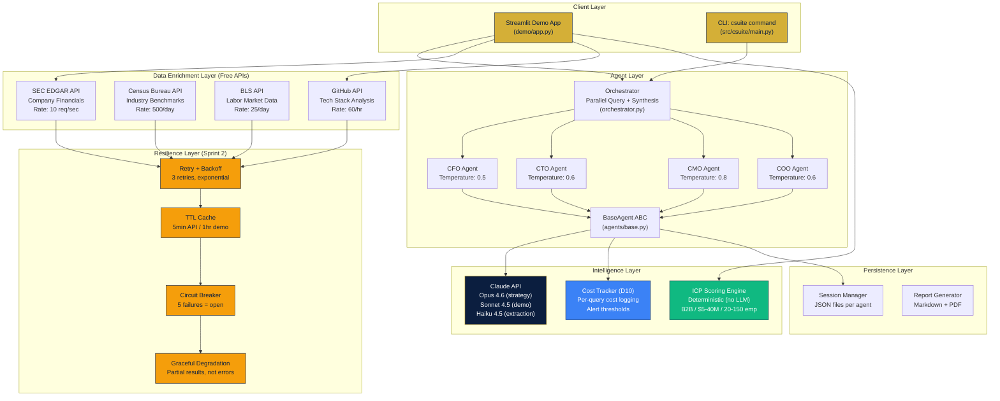

# Cardinal Element -- C-Suite Agent Architecture

## System Architecture Diagram



## Key Design Decisions

| Decision | Choice | Rationale |
|----------|--------|-----------|
| Agent model | Claude Opus 4.6 | Strategic reasoning requires frontier model capability |
| Demo model | Claude Sonnet 4.5 | Faster response for live demos; acceptable quality tradeoff |
| Data APIs | 4 free government APIs | Replace $500+/mo in paid services (BuiltWith, Crunchbase, etc.) |
| ICP scoring | Deterministic (no LLM) | Consistent, explainable, instant -- no API cost per score |
| Session persistence | JSON files | Simple, portable, no database dependency. Upgrade to DB in Sprint 3 |
| Cost tracking | Per-query logging | Directive D10 compliance. Enables margin analysis on every engagement |
| Deployment | Streamlit Community Cloud | Free tier, auto-deploy from GitHub, adequate for demo stage |

## API Cost Model

| Tier | Model | Input ($/MTok) | Output ($/MTok) | Use Case |
|------|-------|----------------|-----------------|----------|
| Executive | Opus 4.6 | $5.00 | $25.00 | Strategy, synthesis, board-level analysis |
| Specialist | Sonnet 4.5 | $3.00 | $15.00 | Research, content, demo responses |
| Extraction | Haiku 4.5 | $1.00 | $5.00 | Data extraction, classification |

## Data Flow: Prospect Research

```
1. User enters ticker (e.g., "EPAM")
   |
2. Check pre-cached demo data (instant, 0 API calls)
   |-- if cached: return immediately
   |-- if not: continue to step 3
   |
3. SEC EDGAR: Company Info + Financials
   |-- Rate limited: 10 req/sec
   |-- Retry: 3x with exponential backoff
   |-- Cache: 5min TTL
   |
4. ICP Scoring Engine (deterministic)
   |-- Revenue fit: $5-40M range
   |-- Employee fit: 20-150 range
   |-- Industry fit: B2B operator keywords
   |
5. Display results in Streamlit
   |
6. User asks C-Suite agent a question
   |
7. Claude API call (Sonnet for demo)
   |-- Cost tracked per Directive D10
   |-- Response rendered in markdown
```

---

*Architecture document -- CTO Sprint 2 Deliverable 5*
*Cardinal Element -- February 2026*
