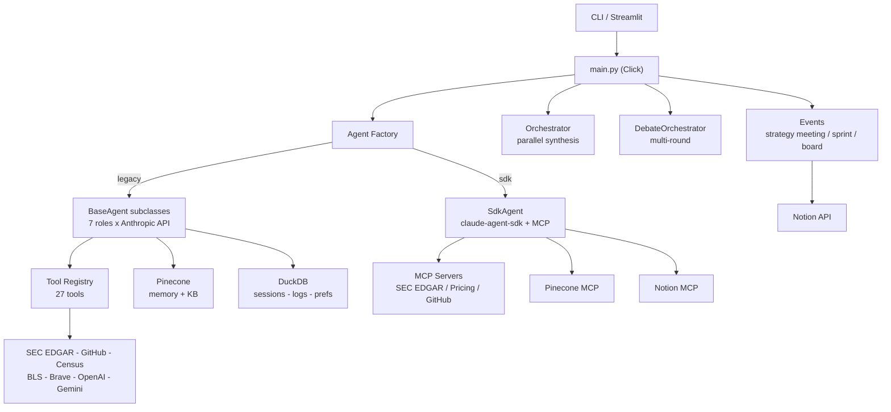

# Project Snapshot: C-Suite

**Date:** 2026-02-22

## Overview

C-Suite is a Python CLI that provides 7 AI executive advisors (CEO, CFO, CTO, CMO, COO, CPO, CRO) for professional services businesses. Built on the Anthropic API with Click, it supports individual agent queries, multi-agent synthesis, multi-round debates, Growth Strategy Audits, sprint planning, board meetings, and report generation. Owned by Scott Ewalt / Cardinal Element -- an AI-native growth architecture consultancy.

## Architecture Diagram



## Architecture

**System pattern:** Async Python CLI monolith with two parallel agent backends (legacy BaseAgent and Agent SDK), function-calling tool loop, and external service integrations.

**Two agent backends:**
- **Legacy** (default): `BaseAgent` subclasses with Anthropic API directly, agentic tool loop (up to 15 iterations), session persistence, memory retrieval, cost tracking, causal tracing.
- **SDK** (`AGENT_BACKEND=sdk`): `SdkAgent` using `claude-agent-sdk` with per-role MCP server access. Simpler but no session persistence yet.

**Data flow (single query):**
`CLI command` -> `main.py` -> `factory.create_agent(role)` -> agent `chat(message)` -> system prompt (role prompt + KB instructions + business context) -> Anthropic API -> tool calls dispatched via `registry.py` -> response streamed via Rich panels.

**Data flow (synthesis):**
`synthesize` -> `Orchestrator.query_agents_parallel()` -> `asyncio.gather` all agents -> `synthesize_perspectives()` -> synthesis prompt -> unified output.

**Data flow (debate):**
`debate` -> `DebateOrchestrator.run_debate()` -> N rounds (opening -> rebuttal -> final), agents parallel within rounds, rounds sequential -> synthesis.

**Key directories:**
```
src/csuite/
├── agents/          # 7 role agents + factory + SDK adapter + MCP config
├── prompts/         # 7 role prompts + KB instructions + debate prompts
├── tools/           # 27 tools: registry, schemas, 11 service clients, resilience
├── events/          # Strategy meeting, sprint, board meeting, Notion writer
├── evaluation/      # Benchmark, LLM judge, report generator
├── memory/          # Pinecone-backed semantic memory
├── storage/         # DuckDB for non-vector state
├── learning/        # Experience log, preferences, feedback loop
├── tracing/         # Causal graph for reasoning traces
├── formatters/      # Audit + dual-output formatters
└── coordination/    # Inter-agent constraints
mcp_servers/         # 3 custom MCP servers (SEC EDGAR, Pricing, GitHub Intel)
demo/                # Streamlit prospect research app
```

## Feature Inventory

| Feature | Status | Key Files | Notes |
|---------|--------|-----------|-------|
| 7 executive agents | **Live** | `agents/*.py`, `prompts/*.py` | All roles functional, Opus model |
| Individual agent queries | **Live** | `main.py` | `csuite ceo "question"` etc. |
| Cross-functional synthesis | **Live** | `orchestrator.py` | Parallel query + synthesis prompt |
| Multi-round debates | **Live** | `debate.py` | 2-5 rounds, fresh agents per round |
| Growth Strategy Audit | **Live** | `audit.py`, `audit_formatter.py` | CFO->CMO->synthesis, branded output |
| Strategy meeting event | **Live** | `events/strategy_meeting.py` | 3-phase: survey->debate->synthesis |
| Sprint planning event | **Live** | `events/sprint.py` | Parallel exec planning from strategy doc |
| Board meeting event | **Live** | `events/board_meeting.py` | Structured interactive session |
| Session persistence | **Live** | `session.py` | JSON files, fork/resume support |
| Tool function calling | **Live** | `tools/registry.py`, `tools/schemas.py` | 27 tools, per-role access control |
| Cost tracking | **Live** | `tools/cost_tracker.py` | Per-query/agent/task aggregation |
| API resilience | **Live** | `tools/resilience.py` | Retry, cache, circuit breaker |
| Pinecone KB learning loop | **Live** | `prompts/kb_instructions.py` | Read before analysis, write novel insights |
| Agent SDK backend | **Implemented** | `agents/sdk_agent.py`, `agents/mcp_config.py` | Works but no session persistence |
| 3 custom MCP servers | **Implemented** | `mcp_servers/` | Hardcoded absolute paths |
| Evaluation benchmark | **Implemented** | `evaluation/benchmark.py` | 10-question, 5-mode comparison |
| Streamlit demo | **Implemented** | `demo/app.py` | Prospect research, ICP scoring |
| Report generation | **Live** | `main.py`, `tools/report_generator.py` | Financial, ops, strategic, product, prospect |
| Pinecone memory | **Live** | `memory/store.py` | Integrated inference, per-role namespaces |
| Causal tracing | **Implemented** | `tracing/graph.py` | Used by strategy meeting + benchmark |
| Interactive mode | **Live** | `main.py` | @ceo, @all, @debate commands |
| Image generation | **Implemented** | `tools/image_gen.py` | OpenAI + Gemini, CMO/CPO only |
| QuickBooks integration | **Stub** | `tools/quickbooks_mcp.py` | Not wired into registry or MCP config |

## Tool & Integration Status

| Integration | Status | Config | Notes |
|-------------|--------|--------|-------|
| Anthropic API | **Active** | `ANTHROPIC_API_KEY` | Core dependency, all agents |
| Pinecone (KB) | **Active** | `PINECONE_API_KEY` + `PINECONE_INDEX_HOST` | 23K records, 17 namespaces |
| Pinecone (memory) | **Active** | `PINECONE_LEARNING_INDEX_HOST` | Per-agent learning store |
| SEC EDGAR | **Active** | No key needed | Free API, company filings |
| Census Bureau | **Active** | No key needed | Market sizing data |
| Bureau of Labor Statistics | **Active** | No key needed | Employment trends |
| Notion | **Active** | `NOTION_API_KEY` | Workspace read/write, event output |
| GitHub | **Configured** | `GITHUB_TOKEN` | Org analysis, tech stack intel |
| Brave Search | **Configured** | `BRAVE_API_KEY` | 2K queries/mo free tier |
| OpenAI (images) | **Configured** | `OPENAI_API_KEY` | GPT Image 1 for CMO/CPO |
| Gemini (images) | **Configured** | `GEMINI_API_KEY` | Imagen 3 for CMO/CPO |
| DuckDB | **Active** | `DUCKDB_PATH` | Local file, sessions/logs/prefs |
| QuickBooks | **Stub** | 4 env vars in .env.example | Not functional |

## Infrastructure

**Storage:** DuckDB (`data/agent_memory.duckdb`) for sessions, experience logs, preferences, debates. Pinecone for two separate indexes -- `ce-gtm-knowledge` (shared KB, 23K records) and a learning index (per-agent memory). Session JSON files in `sessions/`.

**External APIs:** SEC EDGAR, Census, BLS (no auth). GitHub, Brave, Notion, OpenAI, Gemini (API keys). Anthropic (API key, primary). All external clients use `resilience.py` decorators.

**Deployment:** CLI-only, runs locally. CI via GitHub Actions (lint + unit tests on PR, integration tests on push/schedule). Streamlit demo runs locally. No containerization or cloud deployment.

**Key dependencies:** `anthropic>=0.40.0`, `click`, `rich`, `pydantic>=2.0`, `duckdb>=1.0`, `pinecone[grpc]>=5.0`, `httpx`, `claude-agent-sdk` (not in pyproject.toml).

## Roadmap

**From code comments and structure:**
- Sprint 3: Replace Streamlit demo with Next.js/FastAPI (documented tech debt in `demo/app.py`)
- SDK backend: Needs session persistence (`get_session_id()` returns hardcoded `"sdk-session"`)
- QuickBooks: Stub exists, needs OAuth implementation and registry wiring
- MCP servers: Need portability fix (hardcoded `sys.path.insert` with absolute path)

**Partially built:**
- `claude-agent-sdk` dependency not declared in `pyproject.toml`
- `AGENT_BACKEND` setting not documented in `.env.example`
- README.md describes 4 executives (stale); CLAUDE.md is the authoritative reference

## Honest Assessment

**What works well:**
- The legacy agent pipeline is remarkably complete -- 7 agents, 27 tools, full agentic loop with cost ceilings, resilience, and session persistence. This is not a prototype.
- The tool registry architecture is clean: schemas separate from handlers, per-role access control, input validation, prompt-injection sanitization. Adding a tool is mechanical.
- The event system (strategy meeting, sprint, board meeting) composes existing engines without modifying them -- good separation.
- CI catches real issues: lint, types, unit tests on every PR, integration tests on push with per-test timeouts.

**What's fragile or missing:**
- The SDK backend is a thin adapter without session persistence, feedback loop, or learning -- it's a second-class citizen compared to legacy BaseAgent.
- The 3 MCP servers hardcode `/Users/scottewalt/Documents/CE - C-Suite/src` in `sys.path.insert`. They'll break on any other machine.
- `claude-agent-sdk` is imported but not in `pyproject.toml` -- `pip install -e .` won't install it.
- The README is stale enough to be misleading (describes 4 agents, lists wrong MCP integrations). CLAUDE.md is accurate but lives in `.claude/` where external contributors won't find it.
- mypy overrides for `csuite.tools.*` suppress nearly every error code -- the tools module is effectively untyped despite the mypy CI step.

**Gap between claims and reality:**
- The two-layer agent system (Claude Code agents + Python SDK) is documented as independent, and it truly is -- there's no bridge. The 37 Claude Code agent markdown files and the Python CLI agents share nothing except prompts by copy.
- The KB learning loop instructs agents to upsert to Pinecone, but there's no verification that the schema is enforced or that duplicates are prevented. It relies entirely on prompt compliance.
