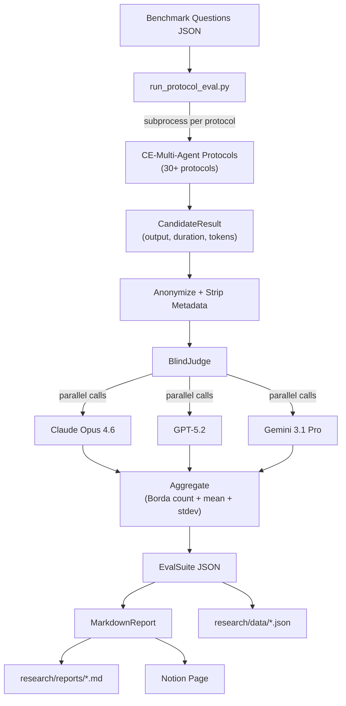

# CE-Evals — Project Snapshot (2026-02-22)

## Overview

CE-Evals is an LLM-as-a-Judge evaluation toolkit that blindly compares multi-agent coordination protocol outputs. It runs protocols from the CE-Multi-Agent repo as subprocesses, anonymizes their outputs, scores them across multiple LLM judges (Claude, GPT, Gemini), aggregates via Borda count ranking, and generates academic-style markdown reports.

## Architecture Diagram



## Architecture

**Pattern:** CLI-driven batch evaluation pipeline with multi-provider LLM backends.

```
CE - Evals/
├── src/ce_evals/
│   ├── config.py              # Pydantic settings (.env loading)
│   ├── core/
│   │   ├── models.py          # CandidateResult, JudgeResult, EvalSuite
│   │   ├── judge.py           # BlindJudge (anonymize → call judges → aggregate)
│   │   ├── judge_backends.py  # Anthropic/OpenAI/Gemini routing
│   │   ├── runner.py          # EvalRunner.run_batch() orchestration
│   │   ├── rubric.py          # YAML rubric loading + prompt injection
│   │   └── cost.py            # Token cost estimation
│   ├── protocols/
│   │   └── blind.py           # Anonymization + metadata stripping
│   └── report/
│       └── markdown.py        # Full report generation (12 sections)
├── examples/
│   ├── run_protocol_eval.py   # Main entry point (batch eval)
│   ├── rerun_failed.py        # Retry failed runs + re-judge
│   └── regenerate_report.py   # Regenerate report from existing JSON
├── rubrics/
│   ├── protocol_quality.yaml  # 6 dimensions (general)
│   └── strategic_advisory.yaml # 7 dimensions (domain-specific)
├── research/
│   ├── data/                  # Raw EvalSuite JSON outputs
│   └── reports/               # Generated markdown reports
└── tests/                     # Empty
```

**Data flow:** Questions load → protocol subprocesses produce output → outputs anonymized (shuffled labels, metadata stripped) → each judge model scores blindly → scores aggregated (mean + stdev + Borda ranking) → EvalSuite serialized → report rendered.

## Feature Inventory

| Feature | Status | Key Files | Notes |
|---------|--------|-----------|-------|
| Blind multi-judge evaluation | **Live** | `judge.py`, `blind.py` | Anonymizes, shuffles, strips protocol markers |
| Multi-provider LLM backends | **Live** | `judge_backends.py` | Anthropic, OpenAI, Gemini routing by model prefix |
| Borda count ranking aggregation | **Live** | `judge.py:85-147` | Cross-judge ranking with disagreement flags |
| Inter-rater agreement analysis | **Live** | `markdown.py` | Stdev tracking, flags >1.0 as high disagreement |
| Rubric-driven prompt injection | **Live** | `rubric.py` | YAML dimensions injected via `{{dimensions}}` template |
| Batch orchestration | **Live** | `runner.py`, `run_protocol_eval.py` | Questions × protocols × replications |
| Retry with exponential backoff | **Live** | `run_protocol_eval.py` | 3 attempts, 2/4/8s delays, 600s timeout |
| Report generation | **Live** | `markdown.py` | 12 sections including per-judge reasoning |
| Failed run recovery | **Live** | `rerun_failed.py` | Finds errors, re-runs, re-judges, merges |
| Report regeneration | **Live** | `regenerate_report.py` | Rebuild report from stored JSON |
| Cost estimation | **Implemented** | `cost.py` | Anthropic pricing only — OpenAI/Gemini missing |
| Test suite | **Stub** | `tests/` | Directory exists, empty |
| Category-matched eval design | **Planned** | `plans/v2_category_matched_eval.md` | V2 plan written, pending protocol validation |

## Tool & Integration Status

| Integration | Status | Config | Notes |
|-------------|--------|--------|-------|
| Anthropic Claude | **Active** | `.env` ANTHROPIC_API_KEY | Primary judge model (Opus 4.6) |
| OpenAI GPT | **Active** | `.env` OPENAI_API_KEY | GPT-5.2; `reasoning_effort="high"` hardcoded, may error on some models |
| Google Gemini | **Active** | `.env` GOOGLE_API_KEY | Gemini 3.1 Pro; ThinkingConfig(8192) enabled |
| CE-Multi-Agent | **Active** | Sibling dir `"CE - Multi-Agent "` (trailing space) | 30+ protocols called via subprocess |
| XAI/Grok | **Configured** | `.env` XAI_API_KEY | Key present, no backend routing code |
| Pinecone | **Configured** | `.env` PINECONE_API_KEY | Key present, no integration code |
| Notion | **Active** | MCP server | Reports published to Notion workspace |

## Infrastructure

- **Storage:** Local JSON files (`research/data/`) + markdown reports (`research/reports/`)
- **External APIs:** Anthropic, OpenAI, Google GenAI — all via official Python SDKs
- **Auth:** API keys in `.env`, loaded via Pydantic BaseSettings
- **Deployment:** Local CLI execution only (no CI/CD, no deployment pipeline)
- **Key dependencies:** anthropic>=0.39.0, openai>=1.0, google-genai>=1.0, pydantic>=2.0, pyyaml>=6.0

## Roadmap

**V2 eval (planned, saved at `plans/v2_category_matched_eval.md`):**
- Two new protocol families: Diagnose & Root-Cause (p16, p24, p25) and Explore & Generate (p26, p27, p23)
- Category-matched questions (5 diagnostic, 5 creative)
- New `creative_ideation.yaml` rubric
- `--questions-file` CLI flag to load from custom JSON
- Pending: user validating each protocol individually first

**Known gaps to fill:**
- OpenAI/Gemini pricing in `cost.py`
- Test coverage (zero tests currently)
- Logging beyond `print()`

## Honest Assessment

**What works well:**
- The core blind judging pipeline is solid — anonymization, multi-model judging, Borda aggregation, and inter-rater agreement tracking all work end-to-end
- Rubric system is clean and extensible (YAML → prompt injection)
- Report generator produces genuinely useful academic-quality output with per-judge reasoning
- Recovery tools (rerun_failed, regenerate_report) show practical maturity

**What's fragile:**
- The path to CE-Multi-Agent has a trailing space in the directory name (`"CE - Multi-Agent "`), which will break on any system that normalizes paths
- OpenAI backend hardcodes `reasoning_effort="high"` unconditionally — will error on models that don't support it
- Cost estimation only covers Anthropic; reports show $0 for GPT/Gemini judge costs
- Protocol descriptions are hardcoded in `markdown.py` — adding new protocols requires code changes

**Gaps:**
- Zero test coverage despite pytest being in dev dependencies
- No logging framework — everything is `print()`
- V1 eval design flaw (same questions across all protocol categories) produced misleading results; v2 plan addresses this but hasn't been executed
- No progress reporting for long-running batch evals beyond sequential prints
