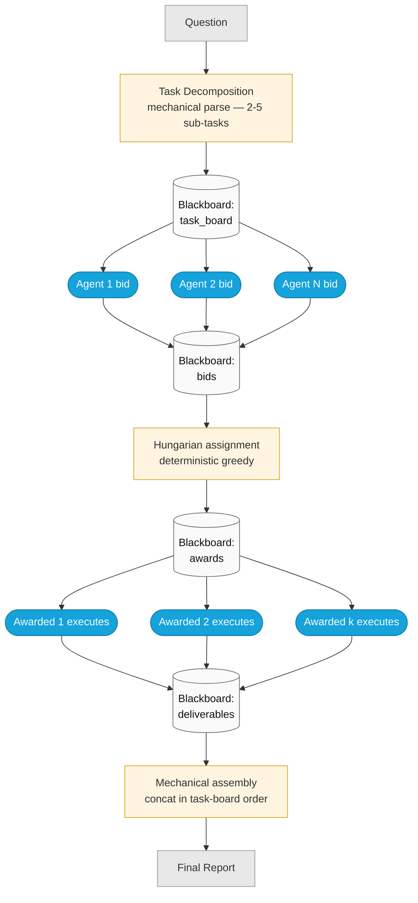
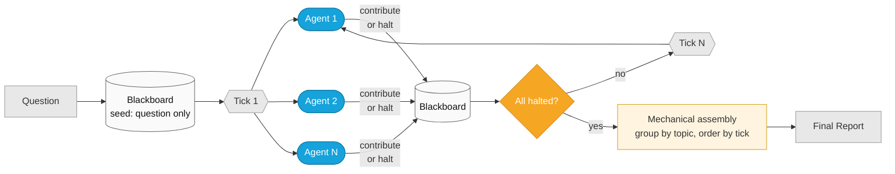
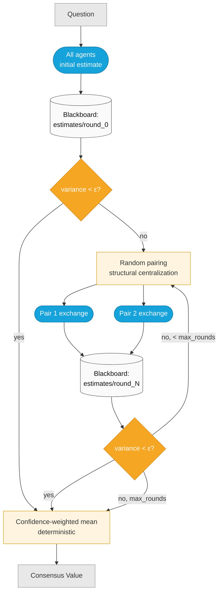
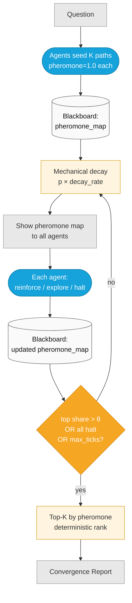
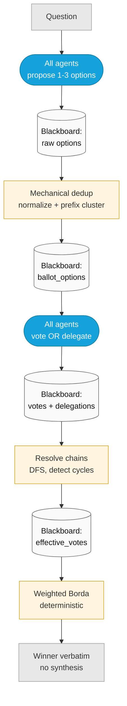

# Decentralized Coordination (P53–P57)

**Category color:** Steel `#16A2DA`

Five protocols where agents coordinate via shared state rather than through a central orchestrator judgment. The Python orchestrator is a pure tick scheduler — it advances ticks, formats Blackboard snapshots into prompts, and writes agent responses back verbatim. It does NOT synthesize content, filter contributions, or decide winners. All aggregation happens via deterministic math in `protocols/decentralized_actions.py`.

Every protocol reports its **four-dimension decentralization scorecard** (control / information / communication / termination) in its `capability.yaml`. Ship-honest — any dimension that's structurally centralized is named explicitly (e.g., P55's random pairing).

---

## P53: Contract Net Protocol

**Mechanism:** Announce → bid → Hungarian assignment → execute → concat.

**Scorecard:** control decentralized (self-bid) · information decentralized (shared task board) · communication via Blackboard · termination = deterministic quorum on awarded deliverables.

**When to use:** Task allocation, heterogeneous agents, multi-part questions. *"Who should own what?"*

---

## P54: Blackboard (Pandemonium) — Reference Implementation

**Mechanism:** Self-dispatched peer contribution. Every tick, every active agent sees the full Blackboard snapshot and independently chooses to contribute a new topic or halt.

**Scorecard:** all four dimensions distributed — control (self-dispatch each tick), information (full BB snapshot), communication (Blackboard), termination (all-halt + safety ceilings).

**When to use:** Ill-structured problems, emergent reasoning order, heterogeneous expertise, want full audit trail.

---

## P55: Gossip Consensus

**Mechanism:** Random-pair pairwise convergence to a numeric estimate. Variance predicate terminates.

**Scorecard honest caveat:** control is **partially centralized** — random pairing is structural to gossip. Information is peer-local (pair only). Communication via BB. Termination = distributed variance predicate.

**When to use:** Numeric/probability estimates, organic convergence, belief aggregation without a judge.

---

## P56: Stigmergic Exploration

**Mechanism:** Pheromone-biased path convergence (ant-colony style). Decay, reinforce, explore.

**Scorecard:** all four dimensions distributed — control (self-select action), information (full pheromone map), communication (Blackboard), termination (dominance predicate + all-halt + safety).

**When to use:** Large solution spaces, strategy exploration, research-style questions where path-dependent reasoning matters.

---

## P57: Liquid Democracy

**Mechanism:** Each agent either ranks options directly OR delegates vote to a peer. Delegation chains resolve deterministically.

**Scorecard:** all four dimensions distributed — control (vote-or-delegate choice), information (full ballot + peer list), communication (Blackboard), termination (distributed quorum on action).

**When to use:** Uneven expertise, want to surface who drove the decision, cross-domain questions.

---

## Decision Matrix

| Your situation | Use |
|---|---|
| "Who should own this?" (task allocation) | **P53 Contract Net** |
| Ill-structured emergent reasoning | **P54 Blackboard** |
| Numeric/probability convergence | **P55 Gossip Consensus** |
| Large strategy space, want exploration | **P56 Stigmergic Exploration** |
| Uneven expertise, weighted voting | **P57 Liquid Democracy** |

## Shared infrastructure

- `protocols/tick_scheduler.py` — `TickOrchestrator` base class (pure scheduler, no content judgment)
- `protocols/decentralized_actions.py` — Pydantic-style action dataclasses + deterministic aggregation helpers (Hungarian, Borda-with-delegation, variance, pheromone decay/dominance)
- `protocols/blackboard.py` — append-only shared state (pre-existing, previously dormant, now the substrate for all five)

Every protocol writes a `decentralization_manifest` entry to its Blackboard on init — inspection tools can assert the four-dimension claim against the run's actual behavior.
