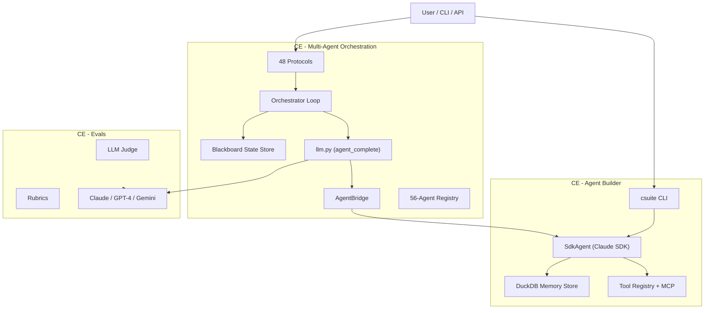

# Project Snapshot — CE AGENTS Monorepo

## Overview

Monorepo for Cardinal Element's agentic AI platform. Three projects: a CLI agent factory (7 executive AI agents), a 48-protocol multi-agent orchestration engine, and an LLM-as-judge evaluation framework. Owner: Scott Ewalt / Cardinal Element — AI-native growth architecture consultancy.

## Architecture Diagram



## Architecture

### CE - Agent Builder (`CE - Agent Builder/`)
- **SdkAgent** wraps Claude Agent SDK with tools, MCP servers, DuckDB memory
- CLI modes: single query, synthesis, debate, audit, interactive
- Hatchling package, installable via `pip install -e ".[dev]"`
- Key files: `src/csuite/session.py`, `src/csuite/tools/registry.py`, `src/csuite/memory/store.py`

### CE - Multi-Agent Orchestration (`CE - Multi-Agent Orchesration/`)
- 48 protocols in `protocols/p{NN}_{name}/` — each has `orchestrator.py`, `prompts.py`, `run.py`, `protocol_def.py`
- Two execution paths: legacy orchestrator (default) and blackboard-driven (opt-in via `--blackboard`)
- Blackboard pattern: append-only state, trigger-based stage dispatch, 7 stage types
- `agent_complete()` in `protocols/llm.py` routes to SdkAgent, LiteLLM, or raw Anthropic SDK
- 56-agent registry with `@category` group syntax
- FastAPI server in `api/` for programmatic access
- React UI in `ui/` (Vite + TypeScript + Zustand)
- Protocol categories: Adversarial, Crowd-Sourcing, Decision Theory, Evaluation, Generative, Negotiation, Sequential, Systems

### CE - Evals (`CE - Evals/`)
- Library-only, no CLI. `src/ce_evals/core/` — judge, rubric, runner, cost tracking
- Multi-backend: Claude, GPT-4, Gemini
- Programmatic use only

### Directory Structure
```
CE - AGENTS/
├── CE - Agent Builder/       # Agent factory + CLI
│   ├── src/csuite/           # Core agent code
│   ├── tests/
│   └── demo/
├── CE - Multi-Agent Orchesration/  # Protocol engine
│   ├── protocols/            # 48 protocols + shared infra
│   ├── api/                  # FastAPI server
│   ├── ui/                   # React dashboard
│   ├── scripts/              # Batch runner, evaluation
│   └── smoke-tests/          # Raw results + synthesis reports
├── CE - Evals/               # Evaluation framework
└── Multi-Agent Research/     # Academic papers (PDF)
```

## Feature Inventory

| Feature | Status | Key Files | Notes |
|---------|--------|-----------|-------|
| 7 Executive Agents (CEO-COO) | **Live** | `src/csuite/session.py` | Claude SDK, tools, memory |
| csuite CLI (query/synth/debate/audit) | **Live** | `src/csuite/cli.py` | All modes working |
| 48 Coordination Protocols | **Live** | `protocols/p*/orchestrator.py` | Legacy path, all tested |
| Blackboard Orchestrator | **Implemented** | `protocols/orchestrator_loop.py`, `stages.py` | All 48 wired, opt-in via `--blackboard` |
| Protocol Tracing | **Implemented** | `protocols/tracing.py` | JSON trace output |
| Agent Registry (56 agents) | **Live** | `protocols/agents.py` | @category group syntax |
| AgentBridge (cross-project) | **Live** | `protocols/agent_provider.py` | Production SdkAgent integration |
| FastAPI Server | **Implemented** | `api/main.py`, `api/runner.py` | Manifest + tool executor |
| React Dashboard UI | **Stub** | `ui/src/` | Pages exist, not connected to API |
| DuckDB Memory Store | **Implemented** | `src/csuite/storage/duckdb_store.py` | Persistent agent memory |
| MCP Server Integration | **Implemented** | `src/csuite/agents/mcp_config.py` | Per-agent MCP configs |
| LLM-as-Judge Evals | **Implemented** | `CE - Evals/src/ce_evals/` | Multi-backend, programmatic |
| Batch Protocol Runner | **Implemented** | `scripts/run_batch.py` | P16-P25 batch tested |
| Smoke Test Results | **Live** | `smoke-tests/` | P16-P25 complete |

## Tool & Integration Status

| Integration | Status | Config | Notes |
|-------------|--------|--------|-------|
| Anthropic Claude API | **Active** | `.env` ANTHROPIC_API_KEY | Opus 4.6 + Haiku 4.5 |
| LiteLLM (multi-provider) | **Active** | `protocols/llm.py` | GPT-4, Gemini routing |
| Pinecone Vector DB | **Configured** | `.env` PINECONE_API_KEY | Knowledge base indexing |
| Notion API | **Configured** | MCP server | Agent workspace integration |
| DuckDB | **Active** | Local file | Agent memory persistence |
| n8n Workflows | **Active** | JSON exports | Automation pipelines |

## Infrastructure

- **Storage**: DuckDB (agent memory), local JSON (traces, smoke-test results)
- **External APIs**: Anthropic (primary), OpenAI, Google (via LiteLLM), Pinecone, Notion
- **Deployment**: Local CLI + local FastAPI server; no cloud deployment yet
- **CI/CD**: None configured
- **Key deps**: anthropic SDK, claude-agent-sdk, litellm, pydantic v2, fastapi, duckdb, ruff, pytest

## Roadmap

- **React UI**: Pages scaffolded (Dashboard, Pipelines, RunHistory, Teams, Settings) but not wired to API
- **Blackboard as default**: Currently opt-in; plan to make default once validated
- **CI/CD pipeline**: Not yet configured
- **Cloud deployment**: No hosting/deployment infrastructure
- **Evaluation integration**: CE-Evals exists but not integrated into protocol runner pipeline
- **Protocol P26-P48**: All have protocol_def.py but limited smoke-test coverage beyond P16-P25

## Honest Assessment

**What works well:**
- Protocol engine is genuinely impressive — 48 distinct coordination patterns with consistent CLI interface
- Blackboard wiring is clean and declarative; new stage types (multi_round, scoped_parallel, compute) cover all protocol shapes
- Agent Builder's SdkAgent is well-abstracted with proper tool/memory/MCP integration
- Cross-project bridge (AgentBridge) cleanly connects Agent Builder agents to Orchestration protocols

**What's fragile or incomplete:**
- React UI is scaffolded but non-functional — no API integration, stores are empty shells
- No CI/CD — all testing is manual smoke-tests
- Blackboard path is untested at scale; only dry-run verified for most protocols
- Directory name has a typo ("Orchesration") baked into all paths
- CE-Evals is disconnected — no automated quality loop feeding back into protocol tuning
- No deployment story — everything runs locally
- Smoke-test coverage only spans P16-P25; 38 protocols have zero runtime validation

**Technical debt:**
- Legacy orchestrator and blackboard orchestrator are parallel paths that will eventually need consolidation
- `return_exceptions=True` pattern (even with logging) masks failures in production runs
- Protocol prompt templates are string constants — no versioning or A/B testing infrastructure
